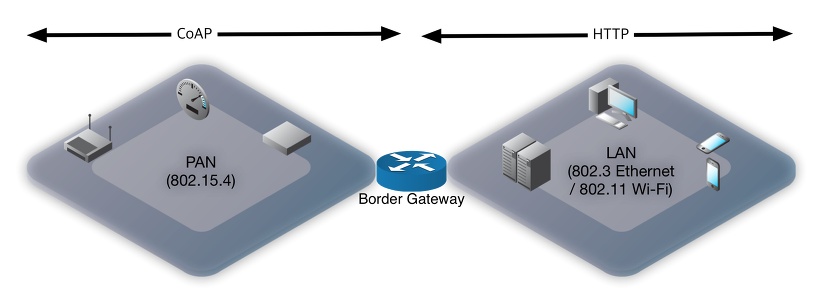
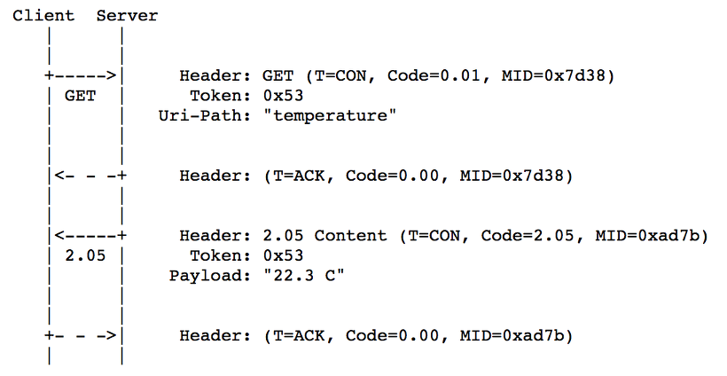

[2015년 Eclipse IOT survey 결과](http://www.slideshare.net/IanSkerrett/iot-developer-survey-2015/18)를 보면 가장 많이 사용하는 메시징 프로토콜은 HTTP, [MQTT](), CoAP 이다.

HTTP가 주요 프로토콜인 것은 두말할 필요도 없고, MQTT도 IBM에서 1999년에 개발하여 2010년에 무료로 오픈하여 나이로는 15년 이상된 것으로 [Facebook Messenger](https://en.wikipedia.org/wiki/Facebook_Messenger) 에서도 사용하는 등 다양한 곳에서 사용 중 이다.
CoAP의 경우 [2010년에 첫 draft](https://datatracker.ietf.org/doc/draft-ietf-core-coap/history/)가 나온 것으로 다른 프로토콜에 비하면 신생 프로토콜이라고 볼 수 있으나 점차로 사용하는 곳이 많아지는 것으로 보인다. 일 예로 작은 메모리를 가진 IOT open OS platform 인 [mbed](https://www.mbed.com/en/platform/mbed-client/), [zephyr](https://www.zephyrproject.org/doc/subsystems/networking/networking.html) 에서도 CoAP을 주 통신 프로토콜로 지원하고 있고, [WICED](http://www.cypress.com/internet-things-iot) 에서도 CoAP 제공하고 있다.

여기에서는 CoAP의 기본적인 특징과 프로토콜의 개요를 정리해 보기로 한다.

## 개요

CoAP 은 Constrained Application Protocol 의 약자로 RFC 7252 로 표준으로 등록되었다.
표준 이름에서도 알 수 있듯이 작은 센서 장치 등과 같이 CPU, 메모리, 통신 bandwidth 등이 제한된(constrained) 기기를 위한 application protocol 이다.

CoAP의 주요 목표는 아래와 같다고 할 수 있다.
- IP 기반, HTTP RESTful 개념을 적용
- 작은 메모리를 위하여 최대한 단순화 및 낮은 전송 대역을 위한 데이타 최소화

즉, CoAP는 아래와 같은 기기를 위하여 만들어진 프로토콜이다.
- 8bit 프로세서와 같은 저사양 센서 모듈에서도 구현 가능한 사양
- 802.15.4 기반의 무선 프로토콜([thread](http://threadgroup.org/), [zigbee](http://www.zigbee.org/)) 대응 (손실, 작은 패킷 크기)
- IPv6 기반 ([6LoWPAN](https://tools.ietf.org/html/rfc4944))
- 쉽게 web(HTTP)에 연동하기 위한 경량화된 RESTful
- CoAP-HTTP gateway에서도 stateless 로도 쉽게 HTTP로 변환하여 전달 가능

[MQTT]()와 비교해보면 아래와 같다.

| 구분 | CoAP | MQTT |
|------|------|---------------------|
| Communication Model | Request-Response, Publish-Subscribe | Publish-Subscribe |
| RESTful | Yes | No |
| Transport Layer Protocol | UDP (TCP도 가능은 함) | TCP (MQTT-SN으로 UDP 대응) |
| Security | DTLS | SSL/TLS |
| Header | 4 Bytes | 2 Bytes |
| Encoding | Binary | Binary |
| 메시지 종류 | 4 | 16 |
| QoS | Yes (Confirmable / Non confirmable message) | Yes (3 levels) |
| Dynamic Discovery | Yes | No |
| Messaging | Asynchronous & Synchronous | Asynchronous |

MQTT는 쉽게 말하면 채팅 개념을 이용하여 Machine-to-Machine 통신을 하는 것이다. 채팅 특성상 1:N 도 가능하고 이런 경우 동기 통신(명령에 대한 응답을 바로 받기) 자체는 불가능하므로 비동기 통신 기반의 메시지 큐 프로토콜 이라고 볼 수 있다. 채팅 서버 처럼 메시지를 중계할 서버(MQTT broker)가 필요하고, 이 서버와 상시 연결이 필요하고, 받고 싶은 메시지(채팅방 개념)를 정의할 subscribe 메시지도 필요하고, 비동기 방식의 특성을 감안하여 전달되는 메시지가 최소한 다음 노드 (MQTT broker)까지는 전달 되었는지를 확인하기 위한 QoS를 제공한다. 이로 인하여 메시지 종류도 16개 정도 된다.

반면에 CoAP는 한마디로 말해서 HTTP를 사용하면 좋겠는데, 리소스 제한상 사용 못하는 제한된 WPAN(Wireless Personal Area Network) 기기를 위한 lightweight 버전이라고 볼 수 있다. Payload 최대 크기가 127 바이트인 802.15.4 를 고려하여 헤더 필드 등 최대한 줄일 수 있는 만큼 줄이고, binary로 인코딩하고, 단순한 UDP를 사용하고, 암호화는 [RFC 6347 DTLS](https://tools.ietf.org/html/rfc6347) 를 이용하여 datagram 단위로 하고, multicasting을 이용하여 discovery 기능을 제공하고, Request-Response 의 polling 방식 이외에 Publish-Subscribe event 방식을 추가한 것이라고 볼 수 있다. 이를 public network에서 운영하는 것도 가능하지만, 이 보다는 WPAN 에게 연결된 gateway까지만 이를 사용하고, 상위 단은 HTTP 등으로 변환하여 기존 웹 프레임웍을 활용하기 위한 것이라고 할 수 있다.

두 프로토콜의 근본이 다르기 때문에 어떤 용도로 사용하느냐에 따라서 각각의 기능이 장점이 될 수도 있고, 단점이 될 수도 있을 것이다.
어느 정도 명확한 구분점은 단말 기기가 802.3, 802.11 기반의 LAN protocol 을 지원하는지, 802.15.4 기반의 PAN protocol 을 지원하는지 일 것이다. 기존에 다른 기기를 위한 웹 플랫폼이 구축되어 있거나, PAN 기반의 장치를 접목한다면 CoAP 이 적절할 수 있고, LAN 기반의 기기를 접목한다면 MQTT 를 이용하는 것이 전체 구성이 단순해질 수 있을 것이다.

## 프로토콜

### 네트워크 구성

CoAP은 아래 그림과 같은 활용을 염두에 두고 설계되었다고 할 수 있다.

개념적으로 HTTP와 비교해보면 아래와 같은 layer 구조를 가진다.

### 헤더 구조

CoAP의 Header는 아래와 같이 고정 4Bytes header와 가변의 optional 필드로 구성된다.

각각의 필드 설명은 다음과 같다.
- Version(VER): 2bits. RFC 7252 CoAP 버전은 1로 고정
- Type(T): 2bits. 메시지 종류 구분. CoAp는 총 4종류의 메시지가 있다.
  - Confirmable (0), Non-confirmable (1), Acknowledgement (2), Reset (3) Reset (3)
- Token Length(TKL): 4bits. Token 필드의 길이를 0~8까지로 Token 필드가 있는 경우 해당 크기 표시.
- Code: 8bits. 3bits.5bits로 나누어서 보면 HTTP의 response code와 유사한 형태가 된다. 예를 들어 401 이 HTTP 에서 ‘Unauthorized’ 인 것처럼 4.01  (이진수로 100.00001b) 은 ‘Unauthorized’이다. 앞의 class 부분만 보면 indicate a request (0), success response (2), client error response (4), server error response (5) 로 나뉘어 진다.
- Message ID: 메시지 재전송 시 중복여부를 확인하기 위한 ID

위와 같이 총 4bytes(32bits)가 고정 헤더이고, token length(TKL) 값에 따라 추가적인 token 필드가 추가된다. Token 필드 뒤에는 option 필드들이 붙는다.
Option 필드는 DHCP의 option 필드와 유사하게 TLV(type-length-value) 형태이나, 크기를 최대한 줄이기 위하여 독특한 방법을 사용하였다. Option 번호(Type)는 크기를 줄이기 위하여 이전 option 값과의 차이를 기록한다. 즉, 이전 option type 이 3 이 었고, 이번 option 이 10이라면 Option delta에는 7을 기록 한다.

- Option Delta: Option delta의 경우도 크기를 줄이기 위하여 0~12는 그대로 이 필드에 기록을 하고, 이 보다 증분이 클때는 13,14 값을 적는다. 이 경우 확장된 Option Delta가 추가로 붙고, 이 확장 필드의 크기는 13인 경우 1bytes, 14인 경우 2bytes가 된다. Option Delta는 0이나 양수이므로 옵션 필드의 순서는 정렬된 순서로 패킷에 들어가야 한다.
- Option Length: Option length도 option delta와 동일하게 0~12는 이 필드만 사용하고, 13,14인 경우에는 각각 1, 2bytes의 Option Length(extended)필드가 추가된다.

최종적인 Option 항목의 끝은 1 byte의 0xff 값을 가진 payload marker가 들어간다. 이 payload marker 이후는 전송할 데이타이 payload가 들어간다.

프로토콜 상에서는 전체 패킷의 크기를 위한 필드가 없다. 이와 같은 이유는 datagram으로 보내기 때문에 항상 앞의 header 정보를 제외한 나머지를 모두 payload로 처리한다. 이것도 크기를 줄이기 위한 것이다.

여기에 6LoWPAN은 link-local address (single hop) 인 경우 IPv6는 2 octets, UDP는 4 octets로 헤더압축이 되고, DTLS도 7bytes  payload가 최대 127 octets인 802.15.4 에서도 fragmentation없이 데이터 전송이 가능하다.

### 메시지 전송

HTTP의 request method와 response code는 헤더의 Code 필드를 이용한다. 위에서도 설명하였듯이 8bits의 Code 필드는 3bits.5bits 로 나뉘어 지고, 이를  중간에 .(점)을 넣어 표기한다. 예를 들어 이진수로 100.00001b은 4.01 ‘Unauthorized’ 코드가 된다.
앞부분의 3bit가 response class로 HTTP와 동일하게 2는 성공, 4는 client error, 5는 server error가 된다. 그리고 0은 method 용도로 다음과 같이 정의된다.
- 0.01: GET
- 0.02: POST
- 0.03: PUT
- 0.04: DELETE

이 8bits code 필드로 이와 같이 구분하면 HTTP와 유사한 형태의 request-response 메시지를 정의할 수 있다.

CoAP은 기본적으로 UDP를 사용하기 때문에 request에 대한 response 응답이 없는 경우 일정 시간 후 request 측에서 재전송 하여야 한다. 이 경우 수신측에서 중복된 메시지 인지를 구분할 수 있도록 Token 필드를 이용한다.

하지만 request에 대하여 응답이 길어지는 경우가 있는 경우 이 방식으로는 문제가 있다. 예를 들어 온도 측정을 요청했는데, 기기에서 온도 값을 얻는데 10초이상 소요될 수도 있다. CoAP에서는 응답이 없는 경우 재전송 주기는 2초이다. 이렇게 응답이 늦어지는 경우 송신측에서는 response가 올때까지 계속 재전송을 하여야 한다. 수신측이야 Token 필드를 이용하여 중복된 메시지 인지를 구분하여 한번의 응답만 가도록 할 수 있으나, 송신측에서는 수신측이 받았는지, 않받았는지를 확인할 방법이 없다.
이와 같은 수신여부를 확인하기 위하여 Type(T)과 Message ID 필드를 사용한다. Type 필드가 0인 경우에는 confirmable로 수신측은 필드값 2로 ACK 응답을 하여야 한다.

일반적인 경우에는 ACK 응답시 아래 처럼 CoAP response message 를 보낸다(piggybacked).

만일 수신측에서 바로 응답을 할 수 없는 경우에는 아래처럼 ACK 응답만 먼저하고, 나중에 request에 대한 response를 할 수 있다.
Message ID(MID)는 confirmable-ack transaction 단위로만 사용하여, 아래와 같은 경우에는 response 시에는 다른 MID를 사용하여야 한다.

위의 예에서 response 시에도 Type(T)필드를 Confirmable(CON)로 요청을 해서 ACK를 받았는데, 이 부분은 Confirmable로 응답할 지, Non-confirmable로 응답할 지는 수신측 마음이다.

Reset Type(T) 필드는 잘못된 응답을 받았을 때 상대방에게 알려주기 위한 것이다.

이와 같이하여 UDP 상에서 효율은 떨어지지만 TCP와 유사한 reliability를 제공할 수 있다.

### Cache & Proxy

제한된 성능의 종단 노드를 대신하여 border gateway에서 어느정도 cache를 해줄 수도 있다. 예를 들어 한번 온도 센서에서 온도값을 읽어오면 일정 시간 내에서는 다시 종단 노드에게 물어보는 것이 아니라 기존에 cache된 값을 사용할 수 있다.

이 부분은 option 필드의 Max-Age와 ETag를 사용한다. 이를 사용하는 예는 아래와 같다.
(아래 그림은 ‘[Introduction to Resource-Oriented Applications in Constrained Networks](https://www.iab.org/wp-content/IAB-uploads/2011/04/Shelby.pdf)’ 에서 발췌)

### Observation

Polling 이 아니라 event 방식을 이용하는 것도 Observe option 필드를 이용하여 지원한다.

## 마치며

이 외에도 큰 사이즈 데이타 전송을 위한 black transfer도 지원하고, multicast address를 이용한 여러 소스에서 응답 받기, service/resource discovery 도 지원하여 별도의 설정없이 자동으로 시스템 구성도 할 수 있다.

Zigbee 보다는 좀더 오픈 마인드로 [Thread](http://threadgroup.org/) 그룹에서 802.15.4, 6LoWPAN, CoAP 등 오픈 표준을 통합하여 표준화 정의 및 호환성 검증을 하기 때문에 센서 네트워크에서 CoAP 이 업계 표준 프로토콜로 자리잡을 가능성은 상당히 커 보인다.

무엇보다도 CoAP 의 장점으로 볼 수 있는 것은 IP 기반이라는 것이다. HTTP나 [SIP](https://www.ietf.org/rfc/rfc3261.txt) 처럼 IP 기반으로 proxy 로 확장을 할 수 있는 구조로, 기존 Gateway방식의 센서 네트워크를 꾸미는 것보다 다음과 같은 면에서 장점이 있을 것이다.
- 보안: 순순한 IP 망이면 end-to-end 암호화도 가능하므로 중간의 proxy를 신뢰도가 낮아도 됨. Gateway 방식은 IP 네트워크와 센서 네트워크간의 데이타 변환을 위하여 복호화 수행하므로 보안 레벨이 높아야 함.
- 확장성: Proxy는 stateless로도 운영 가능하며 변경없이 새로운 서비스 적용 가능
- 투명성: 순수 IPv6 네트워크

(연말에다 프로젝트 마감으로 인하여 문서 작성이 늦어서 급히 마무리 짓느라 뒷 부분이 좀 부실한 것 같아 아쉬움이.. 다음에 좀더 보완을 해 보아야겠다)
