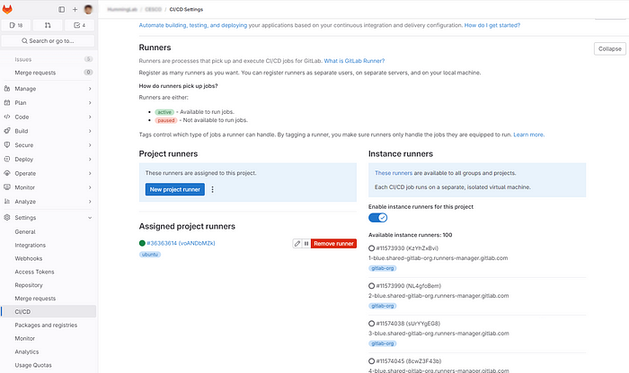
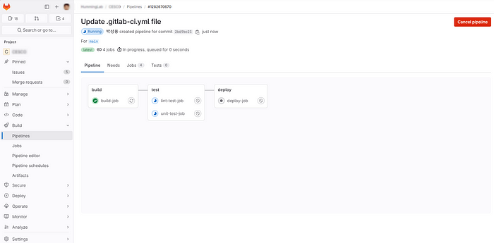

gitlab-runner 셀프호스팅으로 SaaS 비용 아끼기
=====================================================


공개 프로젝트는 GitHub를 사내 비공개 프로젝트는 GitLab를 사용중이다. GitHub의 CI/CD는 github action, GitLab은 gitlab-runner 이다.  SaaS이다 보니 사용 시간에 따라 과금이 되는데, CI/CD같이 시간 많이 소요되는 작업은 클라우드가 불리하다.  사무실내에 놀고 있는 서버를 gitlab-runner 로 돌리는 것이 경제적이기에 셀프호스팅으로 정했다.

예전에 설정해서 썼었기에 그 기억대로 Runner 를 생성하고 확장 메뉴 버튼을 누르면 되겠거니 했는데, 이 방식은 더 이상 지원하지 않는다고 뜬다.


`Group->Runners->Setting button`


---
모든 시작은 공식 문서로부터 해야 하는 법. [https://docs.gitlab.com/runner/install/](https://docs.gitlab.com/runner/install/) 을 정독한다.

먼저 gitlab web console project의 CI/CD Setting 화면으로 간다. 그룹단위로 runner 를 할당도 된다고는 하는데 그룹메뉴는 안 보이는 것으로 봐서 무료 버전은 프로젝트 단위만 가능한 것 같다.


`Project->Settings->CI/CD Settings`


New Project Runner 버튼을 누르고 나면 `glrt-`로 시작하는 token이 생성된다.

---

이제 gitlab-runner를 만들고 등록할 차례.

runner 방식은 의존성이 덜한 docker 로 했다.

그리고 `docker-compose.yaml` 파일을 아래처럼 만들어 컨테이너 실행 후 컨테이너 내부로 들어간다.

```bash  
sungyong@ubuntu:/opt/gitlab-runner$ cat docker-compose.yaml   
services:  
  gitlab-runner:  
    image: gitlab/gitlab-runner:latest  
    container\_name: gitlab-runner  
    restart: always  
    volumes:  
      - /var/run/docker.sock:/var/run/docker.sock  
      - ./config:/etc/gitlab-runner

sungyong@ubuntu:/opt/gitlab-runner$ docker compose up -d  
sungyong@ubuntu:/opt/gitlab-runner$ docker ps  
sungyong@ubuntu:/opt/gitlab-runner$ docker exec -it 287c2bc9a378 bash
```

컨테이너 내부에서는

```bash
root@287c2bc9a378:/# gitlab-runner register  \
--url https://gitlab.com  \
--token glrt-voANDbMZkEYeMqwjs7Z8

Runtime platform                                    
arch=amd64 os=linux pid=111 revision=535ced5f version=16.11.1
Running in system-mode.

Enter the GitLab instance URL (for example, https://gitlab.com/):[https://gitlab.com]:
Verifying runner... is valid                        
runner=voANDbMZk

Enter a name for the runner. This is stored only in the local config.toml file:
[287c2bc9a378]: ubuntu

Enter an executor: shell, ssh, docker, docker-windows, docker+machine, kubernetes, docker-autoscaler, custom, parallels, virtualbox, instance: docker

Enter the default Docker image (for example, ruby:2.7): docker:git

Runner registered successfully. Feel free to start it, but if it's running already the config should be automatically reloaded!  

Configuration (with the authentication token) was saved in "/etc/gitlab-runner/config.toml"

root@287c2bc9a378:/#
```



이제 Project runners에 등록된 것을 확인 할 수 있다.

---

CI/CD의 Hello World template을 사용해 정상동작하는지 확인.


`기본 제공된 hello world template commit`


`파이프라인이 돈다`



`파이프라인 상세 진행 상태`


`초록색으로 파이프라인 완료된 모습 확인`

---
이렇게 gitlab-runner 셀프호스팅 등록을 했다. gitlab 15.10 부터 token 방식이 바뀌어서 기억이 별 도움이 안되어 다시 매뉴얼 정독부터 해야 했지만, 그래도 삽질을 덜한 편이다.