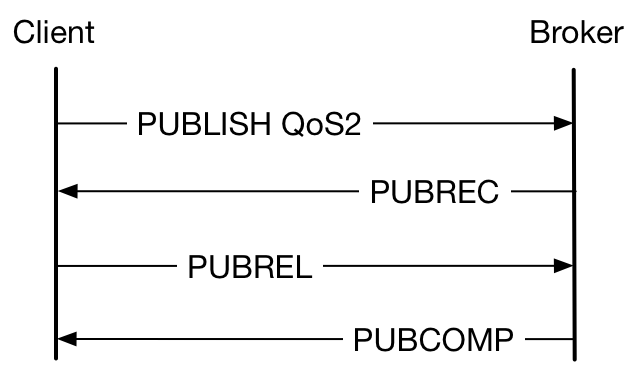
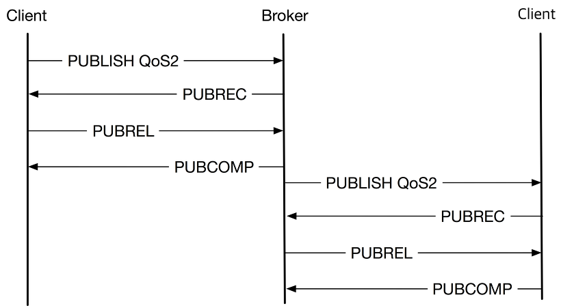

[MQTT](http://mqtt.org/)(Message Queue Telemetry Transport)는 IOT 기기간의 통신을 위한 프로토콜이다.
MQTT 이외에도 IOT용으로 [CoAP](http://coap.technology/)(Constrained Application Protocol), [AMQP](https://www.amqp.org/)(Advanced Message Queuing Protocol), [XMPP](https://xmpp.org/)(eXtensible Messaging and Presence Protocol), [DDS](http://portals.omg.org/dds/)(Data Distribution Service), [Stomp](https://stomp.github.io/)(Simple Text Orientated Messaging Protocol) 등의 다양한 프로토콜이 있고, 각각의 프로토콜은 활용 용도에 따라서 장단점을 가지고 있다.

여기에서는 MQTT의 특징에 대해서 정리하기로 한다.

## MQTT의 특징

### TCP 기반 프로토콜

UDP가 아닌 TCP 기반이라 작은 IOT 기기에서는 사용이 어려울 수 있다.
MQTT 프로토콜에서 사용자 인증을 제공한다. 하지만 이를 위한 username, password 필드는 cleartext로 전달되므로 이들 정보와 송수신 데이타를 보호하기 위하여는 별도로 암호화를 하거나 SSL/TLS를  이용하여 암호화 채널을 이용하여야 한다. 결과적으로 public 망에서 운영되는 IOT 기기는 MQTT, TCP, TLS를 지원할 수 있는 OS와 메모리 사양이 되어야 한다.


### Session Oriented

MQTT는 client-server protocol로, client는 센서 장치 또는 모니터링 장비(PC, 스마트 기기)가 될 수 있고, server는 broker라고 칭한다. Broker는 연결된 client 와의 session을 관리하고, 다른 broker와 연결하기도 한다. 초기 세션 수립은 client에서 broker로 MQTT CONNECT 메시지를 전송하여 이루어진다. 이후 이 TCP 세션은 client가 사용을 중단할 때까지 유지하여 메시지를 주고 받는 용도로 사용한다.

### Extremely Lightweight Publish / Subscribe Messaging Protocol

메시지 큐 프로토콜은 채팅과 유사한 개념이라고 생각하면 된다. IRC 채팅 개념과 비교하면 아래와 같다.

| IRC 채팅 | MQTT |
|---------|------|
| IRC Server | MQTT Broker |
| Channel | Topic |
| Join a channel | Subscribe |

IRC는 명시적인 channel에 join 하는 것이라면 MQTT는 wildcards 로 여러 topic을 한꺼번에 subscribe 할 수 있다.

## Topic

Topic 은 아래의 예와 같이 계층적으로 구성할 수 있다.
(아래 예는 [HiveMQ 의 페이지 내용](http://www.hivemq.com/blog/mqtt-essentials-part-5-mqtt-topics-best-practices)을 참고한 것으로 관련 내용을 읽어보는 것도 좋을 듯 하다)

`myhome/groundfloor/livingroom/temperature`

여러 topic 을 한번에 subscribe 하기 위하여는 single level ’+’나 multi level ‘#’ 을 사용할 수 있다.
Single level은 아래 처럼 topic 중간에 wildcard를 사용하는 것이다.

`myhome/groundfloor/*/temperature`

위와 같이 subscribe 하게 되면 다음과 같은 topic 이 포함된다.

- myhome/groundfloor/livingroom/temperature
- myhome/groundfloor/kitchen/temperature

Multi level wildcard는 마지막에 사용할 수 있다.

`myhome/groundfloor/#`

위와 같이 subscribe 하게 되면 다음과 같은 topic 이 포함된다.

- myhome/groundfloor/livingroom/temperature
- myhome/groundfloor/livingroom/brightness
- myhome/groundfloor/kitchen/temperature

## Subscribe / Publish

일반적인 센서 노드는 정보를 주기적으로 publish 한다(publisher). 반대로 모니터링을 위한 스마트 기기는 필요한 topic 을 subscribe 하여(receiver) 센서 노드에서 오는 정보를 활용한다.

단순한 예를 보면 다음과 같을 것이다.


- Receiver는 수신 받기를 원하는 topic 을 subscribe 한다.
- Publisher는 필요 시점마다 publish 하면 broker는 이를 subscribe 되어 있는 client 로 전달하여 준다.

다수의 receiver가 동일 topic 으로 subscribe 할 수 있고, 이 경우 broker는 모든 subscriber에게 publish message를 전송한다.

동작 방식은 프로토콜 이름 처럼 ‘message queue’ 방식이다. 개념적으로 보면 broker는 다음과 같은 절차로 수행한다.

 1. Publisher에서 수신된 message를 queue 에 저장
 2. QoS 종류에 따라 publisher에 ack 응답
 3. Queue에 저장된 메시지를 subscriber에게 전송 및 QoS 에 따라 ack 응답 확인
 4. Queue에 저장된 메시지를 삭제하거나 설정에 따라 유지 (retain field)


## QoS

메시지를 전송하는 경우 메시지의 특성 및 중요도에 따라서 수신측이 정확히 전송을 받았는지를 확인할 필요가 있다. MQTT 에서는 QoS level로 이와 같은 설정을 할 수 있다.

- QoS 0 (at most once): 수신측 확인 없이 1회 전송
- QoS 1 (at least once): 수신측의 ACK를 확인 및 재전송 (재전송으로 수신측에서는 중복된 message를 받을 수 있음)
- QoS 2 (exactly once): 송신 및 수신측 모두 메시지가 정상적으로 전송되었는 지 확인

여기서 수신측이라 하는 것은 최종 receiver를 말하는 것이 아니라 client이면 broker를 broker이면 publish를 전달하는 client를 말한다.

각각의 QoS 레벨에 따라 전달되는 protocol 절차는 아래와 같다.

- QoS0


- QoS1


- QoS2




QoS0는 별도의 ACK 없이 전송하는 것이고, QoS1는 PUBACK(Publish Acknowledge)로 수신 확인을 한다. 만일 송신 측에서 PUBACK를 지정된 시간에 받지 못하면 PUBLISH를 동일한 ID로 duplicate flag를 설정하여 재전송한다. QoS2 의 경우 송신 측에서 응답을 받았는지도 확인하는 절차로 PUBREC(Publish Received), PUBREL(Publish Release), PUBCOMP(Publish Complete) 까지 4-way handshaking을 수행한다.

Lossless를 보장하는 TCP layer 위에서 운영하는 경우 이와 같은 QoS의 실효성이 의심스러울 수 있다. 또한 이 QoS 절차도 server-client 간의 절차로 아래처럼 QoS2를 사용하는 경우에도 최종단이 수신하기 전에 송신 절차는 종료된다.



이 부분은 다음과 같이 이해하여야 한다.

- QoS0는 client가 전송한 메시지를 broker가 받았는지 확인이 불가능하다. 예를 들어 송신중 연결이 끊어진 경우 이 메시지가 상대방에 전달이 되었는지를 확인할 수 없다. 주기적으로 전송되는 온도 값과 같은 경우 이와 같은 방식으로 전달하여도 문제는 없을 것이다.
- Broker 관점에서 QoS0 메시지는 별도로 queueing을 하지 않는다. QoS1/QoS2 의 경우 queueing 되어 offline 되어 있는 persistence session (아래 clean session 참고)이 이후 online 된 경우 전달할 수 있다.
- QoS2의 경우 동일 메시지가 중복되어 전달되는 경우 심각한 문제를 야기할 수 있는 경우에 사용할 수 있다. QoS1의 경우 PUBACK를 broker가 응답하는 시점에서 연결이 끊어졌다면 송신측은 미전송이지만, 수신측은 정상적으로 수신한 상태가 된다.

WiFi와 같이 채널 연결이 쉽게 끊어질 수 있는 경우라면 QoS 설정에 대하여 충분한 고려가 되어야 할 것이나 보통은 서버의 queueing 필요성에 따라서 QoS0, QoS1 중 선택하여 보내면 될 것 같다.

각각의 client는 초기에 MQTT CONNECT 시 자신이 받을 수 있는 최대 QoS를 지정할 수 있다. 이 경우 broker는 해당 client로 전송할 때 이 QoS보다 높은 경우 설정된 QoS로 낮추어 전송한다.

## Others

### Clean Session

Client는 CONNECT 시 cleanSession flag를 설정하여 보낼 수 있다. Persistence session을 유지하여야 하는 경우에는 이 flag를 false로 하여 보낸다. Broker는 이와 같은 persistence session을 요청하는 client에 대해서는 다음과 같은 정보를 저장 관리 하므로 연결이 끊어졌다 재 종료 시에도 재설정이 필요없다.

- 모든 subscription
- QoS1,2 (송수신) 메시지 중 해당 client가 응답하지 않은 메시지
- Client가 offline 중 발생된 QoS1,2 메시지

표준에는 broker가 이들 정보를 얼마만큼의 시간동안 유지 시켜줄지는 규정되어 있지 않다. Client는 CONNECT ACK 메시지의 sessionPresent 필드로 이전 세션이 broker에 유지되고 있는지를 확인할 수 있다.

CONNECT 시 cleanSession을 true로 설정한 경우 broker는 해당 client에 대한 기존 유지되어 있던 session도 clear하고 향후 연결 종료시에도 session을 저장하지 않는다.

### Retained Message
Client는 PUBLISH로 메시지를 전송 시 retained flag를 설정할 수 있다. 이 field가 true로 되어 있는 경우 broker는 해당 topic의 최종 메시지를 저장하여 차후 subscribe 되는 client가 있는 경우 이를 전송하여 준다.

새로 연결되어 subscribe하는 client 에게 최종 상태를 알려주는 용도로 사용할 수 있다.

### lastWill
Client는 CONNECT 시 lastWill로 비정상용 publish 메시지를 설정할 수 있다. Client가 DISCONNECT와 같이 정상절차로 종료 되지 않고 비정상적으로 연결이 끊긴 경우 이 메시지를 subscriber에게 전송한다.

이를 이용하여 자신의 online, offline 여부를 알려주는 용도로 사용할 수 있을 것이다. 예를 들어 초기 connect시 lastWill message로 ’client/status’ topic 에 ‘offline’으로 payload를 설정해 두고, 처음에 ‘online’으로 publish를 한다면 비정상적으로 종료되는 경우 lastWill 메시지가 전송되어 subscriber는 상태를 알 수 있게 된다.

### Keepalive
Client는 MQTT CONNECT 시 Keep Alive 필드를 이용하여 keep alive interval을 설정할 수 있다. 이 경우 client는 전송할 메시지가 없는 경우 connection 연장을 위하여 PINGREQ/PINGRESP 절차를 수행하여야 한다. Timeout이 되는 경우 broker는 연결을 끊고, lastWill 등의 처리를 해 줄 것이다.

### 기타
참고로 여러 MQTT 서버를 연결하는 것도 bridge를 통하여 가능하다. Bridge는 MQTT client-server protocol 을 이용하여 MQTT broker 간의 메시지를 forwarding 하는 것으로 MQTT protocol 만으로 구현 가능하다. 물론 이 방법은 bridge로 forwarding 되는 메시지로 인하여 규모 확장에 문제가 될 수 있어 clustering 이 지원되는 broker를 검토해볼 필요가 있다.

## 시험

기본적인 동작 시험은 설정이나 사용이 쉬운 [Mosquitto MQTT broker](https://mosquitto.org/)를 이용하는 것이 좋다.
Ubuntu 인 경우 아래처럼 mosquitto를 하거나, docker를 이용하여 설치해볼 수 있다.

```sh
$ apt-get install mosquitto
or
$ docker pull ansi/mosquitto
```

Broker를 설치하면 같이 제공하는 mosquitto_sub, mosquitto_pub utility를 이용하여 subscribe, publish 를 시험해 볼 수 있다.

## 정리

단말이 어느정도 제한된 리소스를 가진 기기이지만, proxy 등의 도움없이 직접 public internet 접속이 가능하고, TCP, TLS 사용이 가능한 경우라면 MQTT를 검토해 볼 수 있을 것이다. TCP 연결 방식이고 모든 연결은 broker를 통하는 방식이라 NAT 상에서도 문제없이 사용가능하다.

참고문서
- [MQTT homepage](https://mosquitto.org/): MQTT OASIS 표준 문서
- [MQTT Essentials](http://www.hivemq.com/mqtt-essentials/): HiveMQ에서 작성한 문서로 MQTT에 대해서 가장 쉽게 잘 설명되어 있다.
