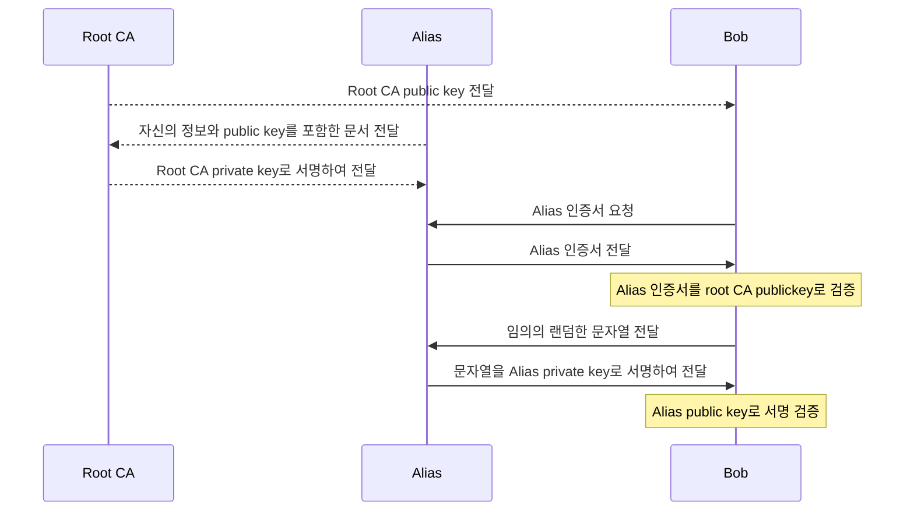

이전글 에서 설명한 [Digital Signature]() 를 사용하면 문서의 서명을 검증할 수 있다. 이 서명을 체이닝으로 이어 나가면 3자 인증 기반의 PKI(Public Key Infrastructure)를 구성할 수 있다. [X.509](https://www.itu.int/rec/T-REC-X.509) 는 ITU-T 에서 정의한 PKI 표준이다. 우리가 흔히 사용하는 인증서는 X.509 표준을 따른다.

인증의 기본적인 방법은 다음과 같은 절차이다. 

- Root 인증 기관(Certificate Authority, CA)가 있다고 하자. Root CA는 자신의 public key 를 별도의 방법으로 공개를 한다. 일반적인 PC 환경에서는 웹브라우저나 OS에 검증된 CA 인증서들이 내장되어 있다.
- Alice는 자신의 정보와 public key를 포함한 문서를 만들어서 Root CA에게 별도의 방법으로 제출(CSR, Certificate Signing Request)하여 root CA의 private key로 서명을 받아온다. 
- 다른 사용자 Bob은 Alice와 통신 시 먼저 인증서를 요청하면 Alice는 자신의 인증서를 보낸다.
- Bob은 Alice의 인증서를 Root CA의 public key로 서명 검증한다. 
- Bob이 Alias에게 임의의 랜덤한 문자열을 보내어 서명을 요청하면 Alias는 자신의 private key로 서명을 하여 Bob에게 보낸다.
- Bob은 Alias의 public key로 서명을 검증해 보면 Alias private key를 들고 있는 Alias 본인임을 알 수 있다.



위와 같은 절차가 PKI를 이용하여 서버 검증을 하는 기본적인 방법이다. 사전에 Root CA 인증서만 있으면, 이 Root CA 가 서명한 인증서를 검증할 수 있다. 이와 깉은 인증 체인을 2단계, 3단계 이상으로 체인으로 연결하여 구성할 수도 있다.


## 인증서 확인해 보기

이 블로그 페이지인 https://blog.humminglab.io/ 의 인증서가 어떻게 서명되어 있는지 확인해 보자. 

OpenSSL CLI 를 이용하여 아래처럼 https 연결을 해보면 인증서 정보를 확인할 수 있다. 

```sh
$ openssl s_client -connect blog.humminglab.io:443 -showcerts < /dev/null
CONNECTED(00000005)
depth=2 C = IE, O = Baltimore, OU = CyberTrust, CN = Baltimore CyberTrust Root
verify return:1
depth=1 C = US, O = "Cloudflare, Inc.", CN = Cloudflare Inc ECC CA-3
verify return:1
depth=0 C = US, ST = California, L = San Francisco, O = "Cloudflare, Inc.", CN = sni.cloudflaressl.com
verify return:1
---
Certificate chain
 0 s:C = US, ST = California, L = San Francisco, O = "Cloudflare, Inc.", CN = sni.cloudflaressl.com
   i:C = US, O = "Cloudflare, Inc.", CN = Cloudflare Inc ECC CA-3
-----BEGIN CERTIFICATE-----
MIIFOTCCBN6gAwIBAgIQDdQcDVXlGE2sHwfigIqCMzAKBggqhkjOPQQDAjBKMQsw
...
InyA8Am8uqZTTQIhALLBPQsXTjH1iaYJFclOG11Sp7axtLWvm4DQLSAQcbIC
-----END CERTIFICATE-----
 1 s:C = US, O = "Cloudflare, Inc.", CN = Cloudflare Inc ECC CA-3
   i:C = IE, O = Baltimore, OU = CyberTrust, CN = Baltimore CyberTrust Root
-----BEGIN CERTIFICATE-----
MIIDzTCCArWgAwIBAgIQCjeHZF5ftIwiTv0b7RQMPDANBgkqhkiG9w0BAQsFADBa
...
6DEdfgkfCv4+3ao8XnTSrLE=
-----END CERTIFICATE-----
```

인증서 체인 구조만 보면 다음과 같다. 

```
depth=2 C = IE, O = Baltimore, OU = CyberTrust, CN = Baltimore CyberTrust Root
depth=1 C = US, O = "Cloudflare, Inc.", CN = Cloudflare Inc ECC CA-3
depth=0 C = US, ST = California, L = San Francisco, O = "Cloudflare, Inc.", CN = sni.cloudflaressl.com
```

- depth=2 인증서는 최상위 루트 인증기관의 인증서(CN = Baltimore CyberTrust Root)이다. 
- depth=1 인증서는 depth=2 루트 이증기관으로 서명된 인증서(CN = Cloudflare Inc ECC CA-3)이다.
- depth=0 인증서는 depth=1 인증서로 서명된 블로그 서버의 인증서(CN = sni.cloudflaressl.com)이다.

내용에 sni.cloudflaressl.com로 되어 있는 것은 DNS proxy 서비스를 Cloudflare에서 하기 때문이다. 

위 로그를 보면 필요한 인증서는 0,1,2 총 세개이지만 보통 TLS 프로토콜에서 서버는 root CA (depth=2)는 보내지 않고, 그 이하의 체이닝된 인증서만 보내준다. 그래서 '-----BEGIN CERTIFICATE-----' 로 된 인증서 2개만 보인다. 

### Depth=0 인증서 내용

OpenSSL CLI로 depth=0 인증서를 확인해 보면 아래와 같고, 이들 정보 중 유용한 것들을 살펴보자.

- Version: 3 으로 [X.509 v3](https://www.rfc-editor.org/rfc/rfc5280) 형식의 인증서 이다. 
- Issure는 이 인증서를 서명한 상위 인증서 정보이다. 사람이 구분할 수 있는 이름이라고 생각하면된다. 이 문장은 depth=1 인증서 정보와 동일하다. 
- Subject는 이 인증서의 이름이라고 보면 된다. 
- Serial Number: 상위 인증기관(depth=1)에서 발행한 유일한 값이다. 인증서의 고유값은 이 Serial number와 Subect 를 합친 정보이다. 
- Validity: 인증서의 유효기간이다.
- Subject Public Key Info: 공개키 정보가 기록되어 있다. 
    - [prim256v1(P-256)](https://neuromancer.sk/std/x962/prime256v1) 이라는 타원암호 알고리즘으로 공개키를 만들었다.
    - pub에는 공개키가 들어있다.
- X509v3 extensions: 인증서의 확장 정보로 인증에 필요한 여러 정보가 들어있다. 
    - Authority Key Identifier, Subject Key Identifier: 인증서 검증을 빠르게 하기 위한 고유한 키 값이다. Authority Key Identifier 정보가 상위 인증서의 Subject Key Identifier 이다.
    - Subject Alternative Name: DNS:blog.humminglab.io 도메인을 인증하기 위한 정보가 들어있다.
    - Key Usage: Digital Signature, 즉 서명 검증용으로만 사용
    - Extended Key Usage: TLS server/client 용도로 한정
    - CRL Distribution Points: CRL(CRL Distribution Points)로 분실 등의 폐기된 목록을 확인용도
- Signature Algorithm: 본 인증서를 서명한 알고리즘과 상위 인증서로 서명한 값이 들어있다. 
    - ecdsa-with-SHA256 방식으로 상위 인증기관(depth=1)의 private key로 서명된 값이다.

이제 상위 인증서로 서명된 값이 맞다면, 이 인증서는 blog.humminglab.io TLS 서버의 인증서라고 확신할 수 있다.

```shell
$ openssl x509 -in depth0.pem -text -noout
Certificate:
    Data:
        Version: 3 (0x2)
        Serial Number:
            0d:d4:1c:0d:55:e5:18:4d:ac:1f:07:e2:80:8a:82:33
        Signature Algorithm: ecdsa-with-SHA256
        Issuer: C = US, O = "Cloudflare, Inc.", CN = Cloudflare Inc ECC CA-3
        Validity
            Not Before: Jun 16 00:00:00 2022 GMT
            Not After : Jun 16 23:59:59 2023 GMT
        Subject: C = US, ST = California, L = San Francisco, O = "Cloudflare, Inc.", CN = sni.cloudflaressl.com
        Subject Public Key Info:
            Public Key Algorithm: id-ecPublicKey
                Public-Key: (256 bit)
                pub:
                    04:a8:95:d8:3a:ee:81:ff:dd:4c:ec:7a:c5:04:09:
                    f7:f8:c3:73:b3:6f:81:c4:31:ab:fb:27:0b:94:94:
                    b5:cd:73:aa:2c:e9:69:4b:6f:f2:0c:8b:8b:f6:6b:
                    07:b2:7f:74:a7:29:19:18:9e:47:b1:7d:6a:ba:17:
                    d6:da:00:d4:85
                ASN1 OID: prime256v1
                NIST CURVE: P-256
        X509v3 extensions:
            X509v3 Authority Key Identifier:
                keyid:A5:CE:37:EA:EB:B0:75:0E:94:67:88:B4:45:FA:D9:24:10:87:96:1F
            X509v3 Subject Key Identifier:
                9A:66:67:9D:36:1F:52:4F:87:45:8D:4D:35:C0:6C:AB:62:34:3B:E3
            X509v3 Subject Alternative Name:
                DNS:*.humminglab.io, DNS:humminglab.io, DNS:sni.cloudflaressl.com
            X509v3 Key Usage: critical
                Digital Signature
            X509v3 Extended Key Usage:
                TLS Web Server Authentication, TLS Web Client Authentication
            X509v3 CRL Distribution Points:

                Full Name:
                  URI:http://crl3.digicert.com/CloudflareIncECCCA-3.crl

                Full Name:
                  URI:http://crl4.digicert.com/CloudflareIncECCCA-3.crl

            X509v3 Certificate Policies:
                Policy: 2.23.140.1.2.2
                  CPS: http://www.digicert.com/CPS

            Authority Information Access:
                OCSP - URI:http://ocsp.digicert.com
                CA Issuers - URI:http://cacerts.digicert.com/CloudflareIncECCCA-3.crt

            X509v3 Basic Constraints: critical
                CA:FALSE
            CT Precertificate SCTs:
                Signed Certificate Timestamp:
                    Version   : v1 (0x0)
                    Log ID    : E8:3E:D0:DA:3E:F5:06:35:32:E7:57:28:BC:89:6B:C9:
                                03:D3:CB:D1:11:6B:EC:EB:69:E1:77:7D:6D:06:BD:6E
                    Timestamp : Jun 16 01:34:26.486 2022 GMT
                    Extensions: none
                    Signature : ecdsa-with-SHA256
                                30:44:02:20:79:1A:9E:46:06:5F:9B:E5:F6:F8:AF:5F:
                                2F:FF:75:49:B2:83:60:32:B2:01:B3:68:BB:DC:E4:98:
                                B9:45:EE:C3:02:20:08:4C:3F:32:8A:3F:B3:CF:0A:A1:
                                07:4E:84:14:2A:E4:59:EF:6B:BB:4D:14:DF:5F:0C:DB:
                                59:80:E9:AF:27:4E
                Signed Certificate Timestamp:
                    Version   : v1 (0x0)
                    Log ID    : 35:CF:19:1B:BF:B1:6C:57:BF:0F:AD:4C:6D:42:CB:BB:
                                B6:27:20:26:51:EA:3F:E1:2A:EF:A8:03:C3:3B:D6:4C
                    Timestamp : Jun 16 01:34:26.504 2022 GMT
                    Extensions: none
                    Signature : ecdsa-with-SHA256
                                30:45:02:21:00:CD:1C:43:81:CC:06:78:BA:3D:31:46:
                                80:C8:A7:CB:D3:E8:8F:E1:1E:1A:33:DA:06:A4:B7:C6:
                                C8:93:A2:2A:6E:02:20:4C:BE:C2:C8:FF:24:03:73:41:
                                BA:D1:5A:D2:B5:6F:BB:8F:90:E1:8F:E2:14:18:49:61:
                                31:45:FC:E7:06:97:D3
                Signed Certificate Timestamp:
                    Version   : v1 (0x0)
                    Log ID    : B7:3E:FB:24:DF:9C:4D:BA:75:F2:39:C5:BA:58:F4:6C:
                                5D:FC:42:CF:7A:9F:35:C4:9E:1D:09:81:25:ED:B4:99
                    Timestamp : Jun 16 01:34:26.490 2022 GMT
                    Extensions: none
                    Signature : ecdsa-with-SHA256
                                30:45:02:21:00:F4:78:99:3D:F9:83:64:3E:9A:64:C2:
                                F2:BB:73:D7:E1:0A:67:E7:AB:54:CA:3D:43:27:A9:56:
                                EC:1B:F2:69:0D:02:20:4E:DC:16:C4:67:6E:54:9E:C1:
                                34:E5:38:D9:68:0A:0E:54:B1:E2:46:D4:01:63:56:D5:
                                22:72:44:83:EC:2E:FE
    Signature Algorithm: ecdsa-with-SHA256
         30:46:02:21:00:be:0b:7c:0b:ce:8a:9a:17:dd:d8:97:d2:e9:
         97:b3:20:34:b0:78:34:20:ff:22:7c:80:f0:09:bc:ba:a6:53:
         4d:02:21:00:b2:c1:3d:0b:17:4e:31:f5:89:a6:09:15:c9:4e:
         1b:5d:52:a7:b6:b1:b4:b5:af:9b:80:d0:2d:20:10:71:b2:02

$ cat depth0.pem
-----BEGIN CERTIFICATE-----
MIIFOTCCBN6gAwIBAgIQDdQcDVXlGE2sHwfigIqCMzAKBggqhkjOPQQDAjBKMQsw
CQYDVQQGEwJVUzEZMBcGA1UEChMQQ2xvdWRmbGFyZSwgSW5jLjEgMB4GA1UEAxMX
Q2xvdWRmbGFyZSBJbmMgRUNDIENBLTMwHhcNMjIwNjE2MDAwMDAwWhcNMjMwNjE2
MjM1OTU5WjB1MQswCQYDVQQGEwJVUzETMBEGA1UECBMKQ2FsaWZvcm5pYTEWMBQG
A1UEBxMNU2FuIEZyYW5jaXNjbzEZMBcGA1UEChMQQ2xvdWRmbGFyZSwgSW5jLjEe
MBwGA1UEAxMVc25pLmNsb3VkZmxhcmVzc2wuY29tMFkwEwYHKoZIzj0CAQYIKoZI
zj0DAQcDQgAEqJXYOu6B/91M7HrFBAn3+MNzs2+BxDGr+ycLlJS1zXOqLOlpS2/y
DIuL9msHsn90pykZGJ5HsX1quhfW2gDUhaOCA3kwggN1MB8GA1UdIwQYMBaAFKXO
N+rrsHUOlGeItEX62SQQh5YfMB0GA1UdDgQWBBSaZmedNh9ST4dFjU01wGyrYjQ7
4zBABgNVHREEOTA3gg8qLmh1bW1pbmdsYWIuaW+CDWh1bW1pbmdsYWIuaW+CFXNu
aS5jbG91ZGZsYXJlc3NsLmNvbTAOBgNVHQ8BAf8EBAMCB4AwHQYDVR0lBBYwFAYI
KwYBBQUHAwEGCCsGAQUFBwMCMHsGA1UdHwR0MHIwN6A1oDOGMWh0dHA6Ly9jcmwz
LmRpZ2ljZXJ0LmNvbS9DbG91ZGZsYXJlSW5jRUNDQ0EtMy5jcmwwN6A1oDOGMWh0
dHA6Ly9jcmw0LmRpZ2ljZXJ0LmNvbS9DbG91ZGZsYXJlSW5jRUNDQ0EtMy5jcmww
PgYDVR0gBDcwNTAzBgZngQwBAgIwKTAnBggrBgEFBQcCARYbaHR0cDovL3d3dy5k
aWdpY2VydC5jb20vQ1BTMHYGCCsGAQUFBwEBBGowaDAkBggrBgEFBQcwAYYYaHR0
cDovL29jc3AuZGlnaWNlcnQuY29tMEAGCCsGAQUFBzAChjRodHRwOi8vY2FjZXJ0
cy5kaWdpY2VydC5jb20vQ2xvdWRmbGFyZUluY0VDQ0NBLTMuY3J0MAwGA1UdEwEB
/wQCMAAwggF9BgorBgEEAdZ5AgQCBIIBbQSCAWkBZwB1AOg+0No+9QY1MudXKLyJ
a8kD08vREWvs62nhd31tBr1uAAABgWolurYAAAQDAEYwRAIgeRqeRgZfm+X2+K9f
L/91SbKDYDKyAbNou9zkmLlF7sMCIAhMPzKKP7PPCqEHToQUKuRZ72u7TRTfXwzb
WYDprydOAHYANc8ZG7+xbFe/D61MbULLu7YnICZR6j/hKu+oA8M71kwAAAGBaiW6
yAAABAMARzBFAiEAzRxDgcwGeLo9MUaAyKfL0+iP4R4aM9oGpLfGyJOiKm4CIEy+
wsj/JANzQbrRWtK1b7uPkOGP4hQYSWExRfznBpfTAHYAtz77JN+cTbp18jnFulj0
bF38Qs96nzXEnh0JgSXttJkAAAGBaiW6ugAABAMARzBFAiEA9HiZPfmDZD6aZMLy
u3PX4Qpn56tUyj1DJ6lW7BvyaQ0CIE7cFsRnblSewTTlONloCg5UseJG1AFjVtUi
ckSD7C7+MAoGCCqGSM49BAMCA0kAMEYCIQC+C3wLzoqaF93Yl9Lpl7MgNLB4NCD/
InyA8Am8uqZTTQIhALLBPQsXTjH1iaYJFclOG11Sp7axtLWvm4DQLSAQcbIC
-----END CERTIFICATE-----
```


### Depth=1 인증서 내용

depth=1 인증서를 확인해 보면 아래와 같고, 이들 정보 중 유용한 것들을 살펴보자.

- Serial Number: 상위 인증기관(인증서 발급자)가 발행한 serial number
- Subject: 인증서의 정보
- Issuer: 인증서의 발급자의 정보
- Subject Public Key Info: 인증서의 공개키 정보. 동일하게 prime256v1을 사용한다.
- X509v3 extensions
    - Key Usage: Digital Signature(디지털서명), Certificate Sign(인증서 서명), CRL Sign(CRL 서명)을 사용할 수 있다. CRL은 Certificate Revocation List의 약자로 분실 등으로 폐기된 인증서 목록을 관리하는 용도이다.
    - Extended Key Usage: 마찬가지로 TLS client/server 인증용도
- Signature Algorithm: sha256WithRSAEncryption 로 상위 인증서의 private 키로 서명되어 있다. 이를 보면 상위 인증서는 EC를 사용하지 않고, RSA를 사용함을 알수 있다. 

```shell
$ openssl x509 -in depth1.pem -text -noout
Certificate:
    Data:
        Version: 3 (0x2)
        Serial Number:
            0a:37:87:64:5e:5f:b4:8c:22:4e:fd:1b:ed:14:0c:3c
        Signature Algorithm: sha256WithRSAEncryption
        Issuer: C = IE, O = Baltimore, OU = CyberTrust, CN = Baltimore CyberTrust Root
        Validity
            Not Before: Jan 27 12:48:08 2020 GMT
            Not After : Dec 31 23:59:59 2024 GMT
        Subject: C = US, O = "Cloudflare, Inc.", CN = Cloudflare Inc ECC CA-3
        Subject Public Key Info:
            Public Key Algorithm: id-ecPublicKey
                Public-Key: (256 bit)
                pub:
                    04:b9:ad:4d:66:99:14:0b:46:ec:1f:81:d1:2a:50:
                    1e:9d:03:15:2f:34:12:7d:2d:96:b8:88:38:9b:85:
                    5f:8f:bf:bb:4d:ef:61:46:c4:c9:73:d4:24:4f:e0:
                    ee:1c:ce:6c:b3:51:71:2f:6a:ee:4c:05:09:77:d3:
                    72:62:a4:9b:d7
                ASN1 OID: prime256v1
                NIST CURVE: P-256
        X509v3 extensions:
            X509v3 Subject Key Identifier:
                A5:CE:37:EA:EB:B0:75:0E:94:67:88:B4:45:FA:D9:24:10:87:96:1F
            X509v3 Authority Key Identifier:
                keyid:E5:9D:59:30:82:47:58:CC:AC:FA:08:54:36:86:7B:3A:B5:04:4D:F0

            X509v3 Key Usage: critical
                Digital Signature, Certificate Sign, CRL Sign
            X509v3 Extended Key Usage:
                TLS Web Server Authentication, TLS Web Client Authentication
            X509v3 Basic Constraints: critical
                CA:TRUE, pathlen:0
            Authority Information Access:
                OCSP - URI:http://ocsp.digicert.com

            X509v3 CRL Distribution Points:

                Full Name:
                  URI:http://crl3.digicert.com/Omniroot2025.crl

            X509v3 Certificate Policies:
                Policy: 2.16.840.1.114412.1.1
                  CPS: https://www.digicert.com/CPS
                Policy: 2.16.840.1.114412.1.2
                Policy: 2.23.140.1.2.1
                Policy: 2.23.140.1.2.2
                Policy: 2.23.140.1.2.3

    Signature Algorithm: sha256WithRSAEncryption
         05:24:1d:dd:1b:b0:2a:eb:98:d6:85:e3:39:4d:5e:6b:57:9d:
         82:57:fc:eb:e8:31:a2:57:90:65:05:be:16:44:38:5a:77:02:
         b9:cf:10:42:c6:e1:92:a4:e3:45:27:f8:00:47:2c:68:a8:56:
         99:53:54:8f:ad:9e:40:c1:d0:0f:b6:d7:0d:0b:38:48:6c:50:
         2c:49:90:06:5b:64:1d:8b:cc:48:30:2e:de:08:e2:9b:49:22:
         c0:92:0c:11:5e:96:92:94:d5:fc:20:dc:56:6c:e5:92:93:bf:
         7a:1c:c0:37:e3:85:49:15:fa:2b:e1:74:39:18:0f:b7:da:f3:
         a2:57:58:60:4f:cc:8e:94:00:fc:46:7b:34:31:3e:4d:47:82:
         81:3a:cb:f4:89:5d:0e:ef:4d:0d:6e:9c:1b:82:24:dd:32:25:
         5d:11:78:51:10:3d:a0:35:23:04:2f:65:6f:9c:c1:d1:43:d7:
         d0:1e:f3:31:67:59:27:dd:6b:d2:75:09:93:11:24:24:14:cf:
         29:be:e6:23:c3:b8:8f:72:3f:e9:07:c8:24:44:53:7a:b3:b9:
         61:65:a1:4c:0e:c6:48:00:c9:75:63:05:87:70:45:52:83:d3:
         95:9d:45:ea:f0:e8:31:1d:7e:09:1f:0a:fe:3e:dd:aa:3c:5e:
         74:d2:ac:b1

$ cat depth1.pem
-----BEGIN CERTIFICATE-----
MIIDzTCCArWgAwIBAgIQCjeHZF5ftIwiTv0b7RQMPDANBgkqhkiG9w0BAQsFADBa
MQswCQYDVQQGEwJJRTESMBAGA1UEChMJQmFsdGltb3JlMRMwEQYDVQQLEwpDeWJl
clRydXN0MSIwIAYDVQQDExlCYWx0aW1vcmUgQ3liZXJUcnVzdCBSb290MB4XDTIw
MDEyNzEyNDgwOFoXDTI0MTIzMTIzNTk1OVowSjELMAkGA1UEBhMCVVMxGTAXBgNV
BAoTEENsb3VkZmxhcmUsIEluYy4xIDAeBgNVBAMTF0Nsb3VkZmxhcmUgSW5jIEVD
QyBDQS0zMFkwEwYHKoZIzj0CAQYIKoZIzj0DAQcDQgAEua1NZpkUC0bsH4HRKlAe
nQMVLzQSfS2WuIg4m4Vfj7+7Te9hRsTJc9QkT+DuHM5ss1FxL2ruTAUJd9NyYqSb
16OCAWgwggFkMB0GA1UdDgQWBBSlzjfq67B1DpRniLRF+tkkEIeWHzAfBgNVHSME
GDAWgBTlnVkwgkdYzKz6CFQ2hns6tQRN8DAOBgNVHQ8BAf8EBAMCAYYwHQYDVR0l
BBYwFAYIKwYBBQUHAwEGCCsGAQUFBwMCMBIGA1UdEwEB/wQIMAYBAf8CAQAwNAYI
KwYBBQUHAQEEKDAmMCQGCCsGAQUFBzABhhhodHRwOi8vb2NzcC5kaWdpY2VydC5j
b20wOgYDVR0fBDMwMTAvoC2gK4YpaHR0cDovL2NybDMuZGlnaWNlcnQuY29tL09t
bmlyb290MjAyNS5jcmwwbQYDVR0gBGYwZDA3BglghkgBhv1sAQEwKjAoBggrBgEF
BQcCARYcaHR0cHM6Ly93d3cuZGlnaWNlcnQuY29tL0NQUzALBglghkgBhv1sAQIw
CAYGZ4EMAQIBMAgGBmeBDAECAjAIBgZngQwBAgMwDQYJKoZIhvcNAQELBQADggEB
AAUkHd0bsCrrmNaF4zlNXmtXnYJX/OvoMaJXkGUFvhZEOFp3ArnPEELG4ZKk40Un
+ABHLGioVplTVI+tnkDB0A+21w0LOEhsUCxJkAZbZB2LzEgwLt4I4ptJIsCSDBFe
lpKU1fwg3FZs5ZKTv3ocwDfjhUkV+ivhdDkYD7fa86JXWGBPzI6UAPxGezQxPk1H
goE6y/SJXQ7vTQ1unBuCJN0yJV0ReFEQPaA1IwQvZW+cwdFD19Ae8zFnWSfda9J1
CZMRJCQUzym+5iPDuI9yP+kHyCREU3qzuWFloUwOxkgAyXVjBYdwRVKD05WdRerw
6DEdfgkfCv4+3ao8XnTSrLE=
-----END CERTIFICATE-----
```

### Root CA (depth=2) 인증서 내용

최상위 인증서는 브라우저나 운영체제에 사전에 내장되어 있다. Linux의 경우에는 /etc/ssl/certs/ 디렉토리에 있다. 

이 인증서의 내용을 보면 다음과 같다. 

- Root CA 이므로 Subject와 서명한 Issuer가 동일한 self-signed 인증서이다.
- Subject Public Key Info: RSA 2048 공개기카 들어있다.

다른 필드도 이전에 설명한 것과 유사하다. 수신측은 이렇게 총 세개의 인증서를 이용하여 각각을 서명 검증하면 최종적으로 서버 인증서가 신뢰할 수 있는 것인지를 판단할 수 있다. 이 과정이 끝나면 blog.humminglab.io 서버의 공개키를 확인할 수 있고, 추가적인 과정을 통하여 진짜로 private key를 가지고 있는지를 확인하면 서버의 신원을 확인할 수 있게 된다.

```shell
$ openssl x509 -in /etc/ssl/certs/Baltimore_CyberTrust_Root.pem -text -noout
Certificate:
    Data:
        Version: 3 (0x2)
        Serial Number: 33554617 (0x20000b9)
        Signature Algorithm: sha1WithRSAEncryption
        Issuer: C = IE, O = Baltimore, OU = CyberTrust, CN = Baltimore CyberTrust Root
        Validity
            Not Before: May 12 18:46:00 2000 GMT
            Not After : May 12 23:59:00 2025 GMT
        Subject: C = IE, O = Baltimore, OU = CyberTrust, CN = Baltimore CyberTrust Root
        Subject Public Key Info:
            Public Key Algorithm: rsaEncryption
                RSA Public-Key: (2048 bit)
                Modulus:
                    00:a3:04:bb:22:ab:98:3d:57:e8:26:72:9a:b5:79:
                    d4:29:e2:e1:e8:95:80:b1:b0:e3:5b:8e:2b:29:9a:
                    64:df:a1:5d:ed:b0:09:05:6d:db:28:2e:ce:62:a2:
                    62:fe:b4:88:da:12:eb:38:eb:21:9d:c0:41:2b:01:
                    52:7b:88:77:d3:1c:8f:c7:ba:b9:88:b5:6a:09:e7:
                    73:e8:11:40:a7:d1:cc:ca:62:8d:2d:e5:8f:0b:a6:
                    50:d2:a8:50:c3:28:ea:f5:ab:25:87:8a:9a:96:1c:
                    a9:67:b8:3f:0c:d5:f7:f9:52:13:2f:c2:1b:d5:70:
                    70:f0:8f:c0:12:ca:06:cb:9a:e1:d9:ca:33:7a:77:
                    d6:f8:ec:b9:f1:68:44:42:48:13:d2:c0:c2:a4:ae:
                    5e:60:fe:b6:a6:05:fc:b4:dd:07:59:02:d4:59:18:
                    98:63:f5:a5:63:e0:90:0c:7d:5d:b2:06:7a:f3:85:
                    ea:eb:d4:03:ae:5e:84:3e:5f:ff:15:ed:69:bc:f9:
                    39:36:72:75:cf:77:52:4d:f3:c9:90:2c:b9:3d:e5:
                    c9:23:53:3f:1f:24:98:21:5c:07:99:29:bd:c6:3a:
                    ec:e7:6e:86:3a:6b:97:74:63:33:bd:68:18:31:f0:
                    78:8d:76:bf:fc:9e:8e:5d:2a:86:a7:4d:90:dc:27:
                    1a:39
                Exponent: 65537 (0x10001)
        X509v3 extensions:
            X509v3 Subject Key Identifier:
                E5:9D:59:30:82:47:58:CC:AC:FA:08:54:36:86:7B:3A:B5:04:4D:F0
            X509v3 Basic Constraints: critical
                CA:TRUE, pathlen:3
            X509v3 Key Usage: critical
                Certificate Sign, CRL Sign
    Signature Algorithm: sha1WithRSAEncryption
         85:0c:5d:8e:e4:6f:51:68:42:05:a0:dd:bb:4f:27:25:84:03:
         bd:f7:64:fd:2d:d7:30:e3:a4:10:17:eb:da:29:29:b6:79:3f:
         76:f6:19:13:23:b8:10:0a:f9:58:a4:d4:61:70:bd:04:61:6a:
         12:8a:17:d5:0a:bd:c5:bc:30:7c:d6:e9:0c:25:8d:86:40:4f:
         ec:cc:a3:7e:38:c6:37:11:4f:ed:dd:68:31:8e:4c:d2:b3:01:
         74:ee:be:75:5e:07:48:1a:7f:70:ff:16:5c:84:c0:79:85:b8:
         05:fd:7f:be:65:11:a3:0f:c0:02:b4:f8:52:37:39:04:d5:a9:
         31:7a:18:bf:a0:2a:f4:12:99:f7:a3:45:82:e3:3c:5e:f5:9d:
         9e:b5:c8:9e:7c:2e:c8:a4:9e:4e:08:14:4b:6d:fd:70:6d:6b:
         1a:63:bd:64:e6:1f:b7:ce:f0:f2:9f:2e:bb:1b:b7:f2:50:88:
         73:92:c2:e2:e3:16:8d:9a:32:02:ab:8e:18:dd:e9:10:11:ee:
         7e:35:ab:90:af:3e:30:94:7a:d0:33:3d:a7:65:0f:f5:fc:8e:
         9e:62:cf:47:44:2c:01:5d:bb:1d:b5:32:d2:47:d2:38:2e:d0:
         fe:81:dc:32:6a:1e:b5:ee:3c:d5:fc:e7:81:1d:19:c3:24:42:
         ea:63:39:a9
```

참고로 위 인증서의 유효기간이 2025년 5월까지로 글 작성한 시점이 2023년 이므로 2년 가량 밖에 남지 않은 상태이다. 일반적인 PC 인 경우에는 이 인증서가 만료되기 전에 브라우저나 OS를 업그레이드를 하기도 하고, 여러 루트 인증서를 내장하고 있기 때문에 큰 문제가 되지 않을 수 있다. 

하지만 IoT 장비의 경우 제한된 메모리 용량으로 인하여 보통은 하나의 root CA만 내장하고, 이로 서명된 MQTT 나 HTTPS 서버와 통신을 하는 경우가 많다. 이런 경우에는 이 root CA 의 인증서 유효기간이 만료되면 통신이 불가능하게 된다. 예를 들어 위와 같은 root CA를 이용하는 경우에 기기를 2년 동안 전원을 끄고 방치한 상태에서 켜보면 인증서 유효기간이 만료되어 더이상 OTA(Over The Air) 업그레이드도 불가능하고 IoT 서버와도 통신이 불가능하게 된다. 

AWS IoT Core의 경우에는 아래 페이지를 보면 루트 인증서에 대한 정보가 나와 있다. 이를 사용하는 경우 인증서의 유효기간이 2038년 처럼 매우 길게 되어 있어 이런 문제가 발생할 가능성이 낮지만, 다른 CA에 서명된 경우 해당 CA의 인증서 유효기간을 반드시 확인하여 서비스가 중단되는 일이 없도록 하여야 한다.
- [AWS IoT Core 서버인증](https://docs.aws.amazon.com/ko_kr/iot/latest/developerguide/server-authentication.html)


## 인증서 저장 방식

인증서는 text 형태로 저장하는 PEM 형식과 binary 형태로 저장하는 DER 형식이 있다.

### PEM 형식

PEM 형식은 다음처럼 구성된다. "HELLO" 부분이 용도에 따라서 "CERTIFICATE", "PRIVATE KEY", "CERTIFICATE REQUEST" 등으로 구분될 수 있다. 

내용은 text로 보여지도록 base64 인코딩 되어 있다.

```
-----BEGIN HELLO-----

base64-encoded-text

-----END HELLO-----
```

### DER 형식

DER 형식은 PEM 의 본문이 base64 인코딩 되어 있지 않고 그대로 binary 형태로 저장되어 있다.

예를 들어 depth1.pem 을 다음과 같이 DER로 변경할 수 있다.

```shell
$ openssl x509 -in depth1.pem -out depth1.der -outform DER
```

마찬가지로 DER 형식의 인증서 내용을 확인해 볼수도 있다. 

```shell
$ openssl x509 -in depth1.der -inform DER -text -noout
```

DER 형식은 ASN.1 형식으로 인코딩 되어 있으며, 이를 파싱하여 인증서 내용을 확인할 수 있다. 아래와 같이 asn1parse 명령을 사용할 수 있다.

```shell
$ openssl asn1parse -in depth1.der -inform DER
```


## 정리

이상으로 인증서 관련한 사항은 이해에 필요한 내용 위주로 간략하게 정리해 보았다. 
